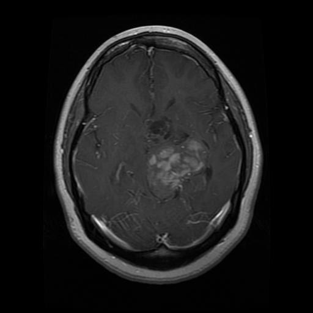

# Brain Tumor Detection using YOLOv10
<br />
<div align="center">
    
</div>

## Project Overview 💼
<p>This is my first side-project aimed at researching image processing using YOLO (You Only Look Once), specifically leveraging the brand new YOLOv10 version. The project focuses on classifying brain tumor images from a large dataset, identifying each point of interest within the images.</p>

## Purpose 🤗
The primary purpose of this project is to ->
- Explore the capabilities of YOLOv10 for object detection in medical imaging.
- Develop a model that can accurately detect and classify brain tumors from MRI images.

## Dataset 🏗
The dataset used in this project comprises a large number of brain tumor images. Each image has been meticulously annotated to ensure accurate detection and classification.


## Example of Dataset
Please note that the dataset is not included in this repository due to its size. You can use your own dataset or download publicly available brain tumor datasets.

## Project Structure
The project is organized as follows:
```bash
brain-tumor-detection/
├── data/
│   ├── images/
│   │   ├── train/
│   │   └── val/
│   ├── labels/
│   │   ├── train/
│   │   └── val/
├── yolov10/
│   ├── __init__.py
│   ├── yolov10.py  # Custom YOLOv10 implementation
│   └── utils.py  # Utility functions for YOLOv10
├── custom_dataset.py  # Custom dataset loader
├── train.py  # Training script
├── inference.py  # Inference script
├── requirements.txt  # Dependencies
├── README.md
│── example_image.png  # Example image for illustration
└── images/
    ├── # images for etc.
```

## Installation

````bash
git clone https://github.com/yourusername/brain-tumor-detection.git
cd brain-tumor-detection
pip install -r requirements.txt
````

## Usage 
Ensure your data is organized in the following structure:
``` bash
├── data/
│   ├── images/
│   │   ├── train/
│   │   └── val/
│   ├── labels/
│   │   ├── train/
│   │   └── val/
```


